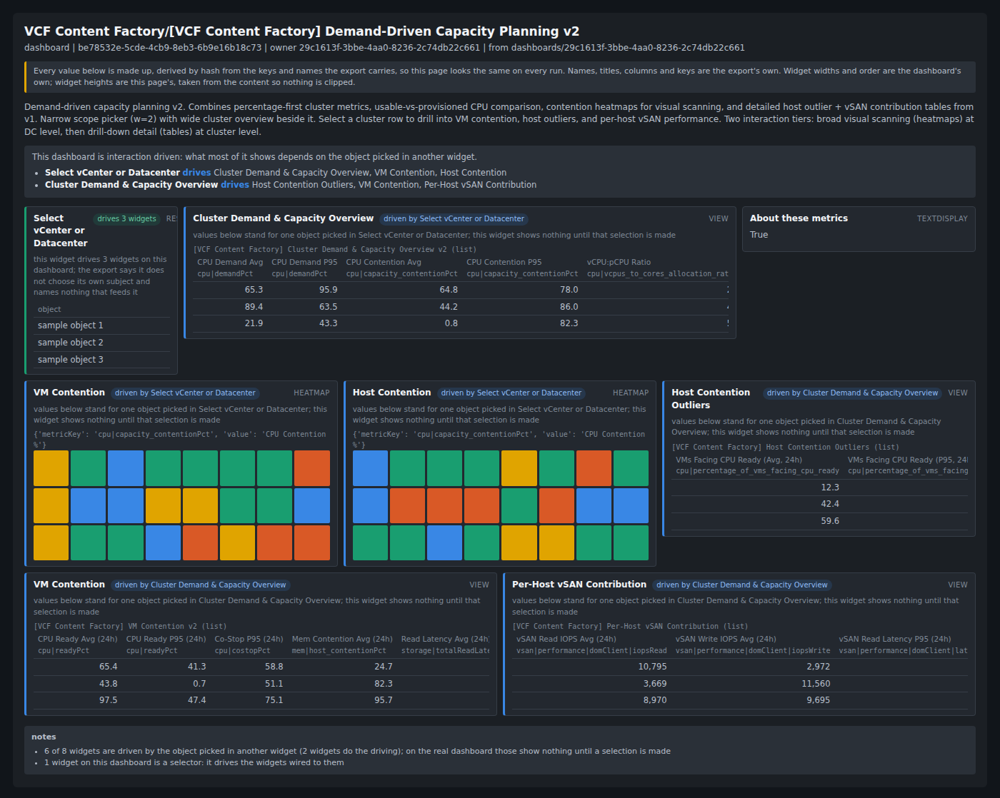
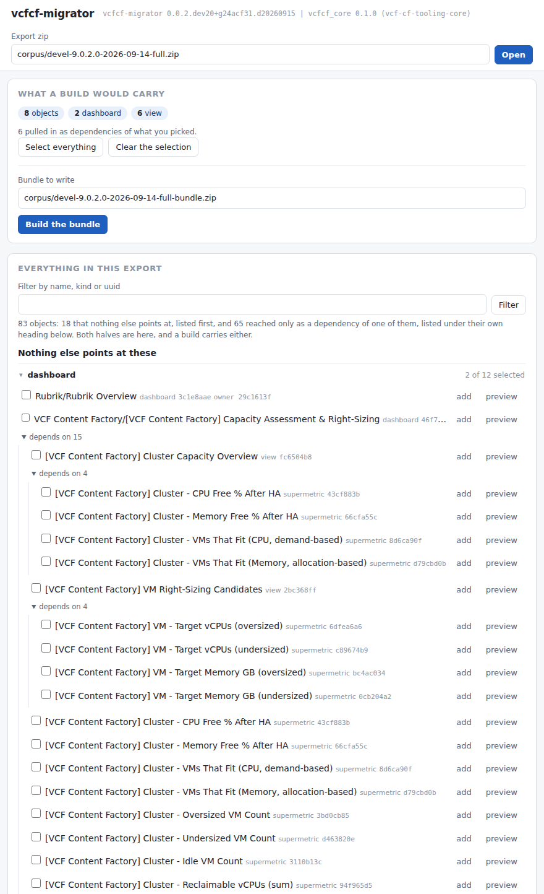

# vcf-cf-migrator

[](https://github.com/sentania-labs/vcf-cf-migrator/releases/latest)
[](LICENSE)

You have an older VCF Operations instance carrying years of custom content,
and you are standing up a new one. You do not want to drag all of it across.
But a content export is all or nothing, the names alone will not tell you what
a dashboard is, and pulling one out by hand breaks the views and super metrics
under it.

Review it, preview it, and write a new import bundle holding only what you
picked and everything it needs.



Every object in the export gets a page like this one. The values are invented;
the names, columns, metric keys, layout and wiring are the export's own.

## Run it

Download the binary for your machine from the
[latest release](https://github.com/sentania-labs/vcf-cf-migrator/releases/latest),
then:

```
vcfcf-migrator ui my-export.zip --source-version 9.0.2
```

That opens the page, which does the whole job. An export does not record which
version it came from, so tell it; 8.10 and later are accepted.

First run: `chmod +x` on Linux and macOS, allow it once under macOS Privacy and
Security, or answer Windows SmartScreen with More info, then Run anyway.



Tick what you want. What it depends on comes with it, said out loud, and the
tool will not let you drop something the rest of your selection still needs.
Then Build the bundle, and import it on the target the way you exported.

It handles dashboards, views, super metrics, groups, symptoms, alerts, reports
and notification rules, runs on your workstation, and never talks to either
instance, so it needs no credentials and no network. From the
[VCF Content Factory](https://github.com/sentania-labs/vcf-content-factory), on
that project's
[`vcf-cf-tooling-core`](https://github.com/sentania-labs/vcf-content-factory/releases?q=core-v).

## Get an export

In VCF Operations on the source instance: Administration, then Content, then
Export. Choose the content you want out, or all of it, and save the zip. If it
includes notification rules or outbound settings, VCF Operations asks for an
encryption password. Remember it: this tool never needs it, but whoever imports
the bundle on the target does.

## What it does with your content

It carries documents through untouched. A dashboard you select arrives byte for
byte as the export held it, and the tool rebuilds the containers around them and
nothing else, so anything it does not understand survives the trip. The same
jobs are on the command line if you want to script them: `inspect`, `tree`,
`preview <object>`, `build --select <file> --out <bundle.zip>`. `--help` has the
detail.

## Reporting a problem

`--log run.log` records what it did and why, in enough detail to diagnose a
failure without the export. Logs carry content names and ids, and the file
paths you gave the tool, which on your machine may carry your own user name.
They never carry credentials, the export password, encrypted values, or
anything about the people in the export: a dashboard's owner appears as
`owner-1`.
