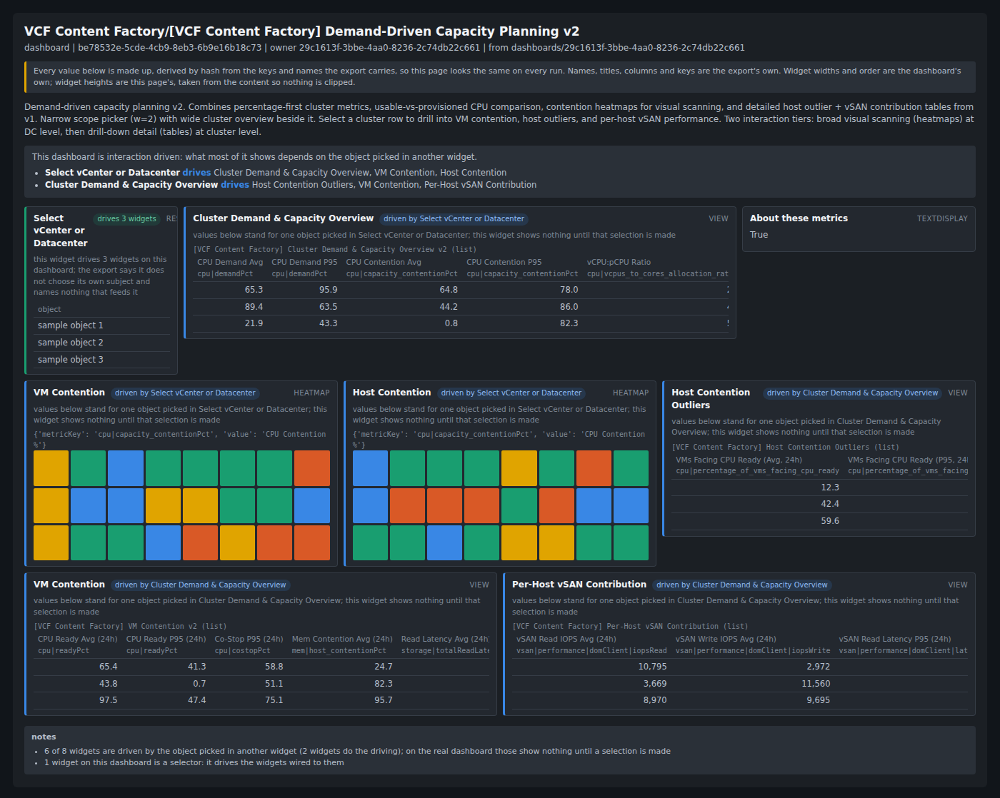

# VCF Content Migrator

[](https://github.com/sentania-labs/vcf-cf-migrator/releases/latest)
[](LICENSE)

Move selected custom content between VCF Operations instances. Open a content
export, preview what is in it, and choose what to keep. The tool adds the
available dependencies and writes a smaller ZIP for you to import on the target.

It runs on your workstation. The ZIP workflow needs no instance credentials or
connection to either Operations instance. Previews use sample values, not live
monitoring data.

> This README describes the current source. The latest packaged release is
> available below; its interface may differ until the next release.

## Download and open

Download the file for your operating system from the
[latest release](https://github.com/sentania-labs/vcf-cf-migrator/releases/latest).
Choose the archive for your computer and extract it:

| Your computer | Download |
| --- | --- |
| Mac with Apple silicon (M-series chip) | `vcfcf-migrator-macos-arm64.zip` |
| Mac with an Intel processor | `vcfcf-migrator-macos-x86_64.zip` |
| Linux x86-64 | `vcfcf-migrator-linux.tar.gz` |
| Windows x86-64 | `vcfcf-migrator-windows.zip` |

Each archive contains `vcfcf-migrator`, or `vcfcf-migrator.exe` on Windows.
Older releases provide executables directly, with the platform in the filename.

On a Mac, **Apple menu > About This Mac** shows the chip or processor.

On Windows, double-click the extracted executable. On macOS or Linux, open a
terminal in the extracted folder and run:

```sh
./vcfcf-migrator
```

If the executable permission was lost when extracting, run
`chmod +x vcfcf-migrator` first. Keep the terminal open while using the app.
All three platforms open a native window; the application does not start a
local web server.

Linux requires a graphical desktop and Qt's system libraries. The
[Ubuntu 24.04 package list](packaging/linux-runtime.txt) names the required
runtime packages; other distributions use different package names. The
command-line tools also work without a graphical session.

If your computer blocks the download, follow your organization's software
approval process. Include the release version and the exact message when
reporting a startup problem.

## Create a migration bundle

1. **Export from the source.** In VCF Operations, go to **Administration >
   Content > Export**, choose the content to export, and save the ZIP. Include
   the dependencies of the objects you intend to move. If Operations asks for
   an encryption password, keep it for the target import. The migrator does not
   need that password.
2. **Open the ZIP.** Use **Browse** in the desktop window, or enter the file's
   local path and choose **Open export**.
3. **Review and select.** Choose a content type and search by name. Click an
   object to see its preview, dependencies, and details. **Select shown** adds
   the filtered results; **Select all** includes the whole readable inventory.
   Required objects are added automatically. Removing a direct pick keeps it
   included if another pick still needs it.
4. **Review the bundle.** Choose **Review bundle** to check your picks and the
   dependencies they bring along. Resolve missing dependencies by using a more
   complete source export or removing the affected picks. Required references
   that cannot be identified as built-in content are treated as missing;
   there is no override. Policy references do not block a build, but their
   assignments must be checked on the target.
5. **Write and import.** Save to a new ZIP, then use the target instance's
   content import. Supply the original export password if requested. Open the
   imported objects on the target and check that their widgets, data sources,
   and links work.



The preview helps you recognize content before moving it. It preserves the
export's names, layout, columns, and metric keys, but its values are invented.
It cannot confirm that the target has the adapters or resources a dashboard
needs.

## What carries across

Supported content includes dashboards, views, super metrics, custom groups,
symptoms, alert definitions, recommendations, reports, notification rules,
notification templates, and outbound settings.

Selected content documents are copied unchanged. Encrypted settings stay
encrypted, and the original export remains your source copy. Policies and other
unsupported export members are not included in the new bundle. Review warnings
before importing; this is a content selection tool, not a backup or a check of
the target's configuration.

Dashboard navigation links still need checking on the target. Their dependency
handling remains under investigation in
[#3](https://github.com/sentania-labs/vcf-cf-migrator/issues/3).

## If something goes wrong

- **Missing dependencies:** export the required content from the source, or
  remove the picks that depend on it. A target might already have an object,
  but the offline tool cannot verify that.
- **Unexpected inventory count:** do not assume a manifest total equals the
  selectable inventory. One reported dashboard-count discrepancy remains
  unresolved in [#37](https://github.com/sentania-labs/vcf-cf-migrator/issues/37).
- **Empty widgets after import:** allow Operations time to finish processing,
  then check the target's adapters, resources, and widget configuration.
- **Slow loading or selection:** let the current action finish before trying
  again. Include the export size and the operation you were performing in a
  problem report.

In **Help & diagnostics**, choose **Save anonymized diagnostics** and attach
that file to an [issue](https://github.com/sentania-labs/vcf-cf-migrator/issues).
Include the application version, what you tried, and what happened.

Shared diagnostics retain counts, timings, and operation results while
replacing paths, account details, machine details, and content identifiers with
anonymous labels. **Local file logs are private, not anonymized diagnostics.**
Do not attach them, source exports, or screenshots containing private content
to a public issue. Previously saved reports are not changed by an upgrade.

## Command-line use

The same tools are available from a terminal. These examples assume the
executable is named `vcfcf-migrator` and is on your PATH; otherwise use its full
path or downloaded filename.

```sh
vcfcf-migrator ui source-export.zip
vcfcf-migrator inspect source-export.zip
vcfcf-migrator tree source-export.zip
vcfcf-migrator preview source-export.zip 'Dashboard name' --out preview.html
vcfcf-migrator build source-export.zip --select selection.txt --out migration.zip
```

In `selection.txt`, put one object name or identifier on each line. Blank lines
and lines starting with `#` are ignored. Use an identifier when names are not
unique. `vcfcf-migrator build --help` lists the build options.

For Python users, the release also includes a wheel. Install it with
`python -m pip install /path/to/the-downloaded.whl` using Python 3.9 or newer.
Installation downloads dependencies; working with local exports afterward
needs no instance connection.

Built on the [VCF Content Factory](https://github.com/sentania-labs/vcf-content-factory)
core library. Development and design notes are in [docs](docs/README.md).
